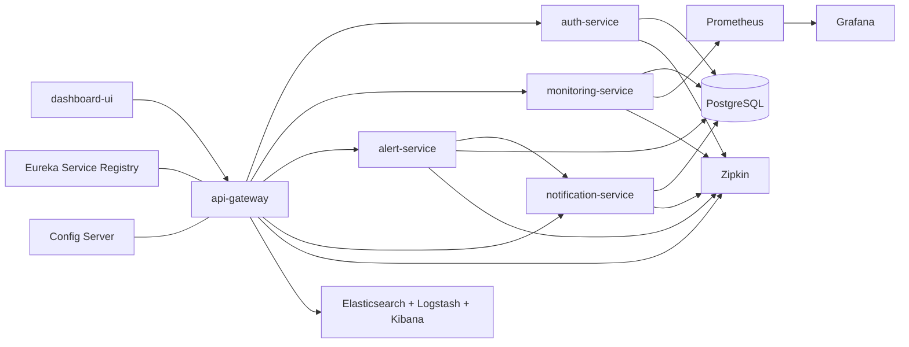

# Cloud-Native Observability & Incident Response Platform

Production-oriented Spring Boot microservices platform for DevOps, SRE, monitoring, incident response, Kubernetes visibility, CI/CD readiness, distributed tracing, centralized logging, and operational dashboards.

The project simulates enterprise monitoring products such as Datadog, Grafana Cloud, New Relic, and Dynatrace while keeping the codebase approachable for local development.


## Architecture



## Services

| Component | Port | Purpose |
| --- | ---: | --- |
| `service-registry` | 8761 | Eureka discovery |
| `config-server` | 8888 | Central Spring Cloud Config |
| `api-gateway` | 8080 | Routing, CORS, retries, circuit breakers, correlation IDs |
| `auth-service` | 8081 | JWT login and RBAC |
| `monitoring-service` | 8082 | Infrastructure, Kubernetes, traces, reports |
| `alert-service` | 8083 | Alert rules, alerts, incidents, timelines |
| `notification-service` | 8084 | Slack/email/Discord/SMS mock delivery history |
| `dashboard-ui` | 3000 | React SRE dashboard |

## Features Implemented

- Spring Boot microservices with Eureka, Config Server, API Gateway, OpenAPI, Actuator, Prometheus metrics, and Zipkin tracing.
- PostgreSQL persistence with separate databases for auth, monitoring, alerts, and notifications.
- JWT authentication with `ADMIN`, `DEVOPS_ENGINEER`, `SRE_ENGINEER`, and `VIEWER` roles.
- Infrastructure monitoring APIs for CPU, memory, disk, network, uptime, availability, and CSV reports.
- Kubernetes monitoring APIs for cluster overview, pods, deployments, namespaces, restarts, HPA, replicas, and CrashLoopBackOff detection.
- Alert management with threshold rules, alert states, automatic incident creation, incident assignment, root cause notes, and resolution.
- Notification service with persistent channel history for Slack, email, Discord, and mock SMS.
- Resilience4j circuit breaker around alert-to-notification fanout.
- Dockerfiles, Docker Compose, Kubernetes manifests, Helm starter chart, Prometheus config, Grafana dashboard provisioning, ELK pipeline config, and GitHub Actions CI/CD.
- Dark responsive React dashboard matching the provided monitoring-platform reference style.

## Quick Start

Copy the sample environment file if you want to override defaults:

```bash
cp .env.example .env
```

Build the Spring services:

```bash
mvn clean package
```

Start the full local stack:

```bash
docker compose up --build
```

Run only the dashboard during frontend development:

```powershell
powershell -NoProfile -ExecutionPolicy Bypass -File .\scripts\start-dashboard-dev.ps1
```

The helper starts Vite on http://127.0.0.1:3002 by default. It intentionally calls `npm` through PowerShell instead of launching `npm.cmd` through `cmd start`, which avoids quoting issues around paths such as `C:\Program Files\nodejs\npm.cmd`.

Access points:

| App | URL |
| --- | --- |
| Dashboard UI | http://localhost:3000 |
| API Gateway | http://localhost:8080 |
| Eureka | http://localhost:8761 |
| Prometheus | http://localhost:9090 |
| Grafana | http://localhost:3001 |
| Zipkin | http://localhost:9411 |
| Kibana | http://localhost:5601 |

Demo users:

| Role | Email | Password |
| --- | --- | --- |
| Admin | `admin@ops.local` | `admin123` |
| DevOps | `devops@ops.local` | `devops123` |
| SRE | `sre@ops.local` | `sre123` |
| Viewer | `viewer@ops.local` | `viewer123` |

## API Examples

```bash
curl -X POST http://localhost:8080/api/auth/login \
  -H "Content-Type: application/json" \
  -d '{"email":"admin@ops.local","password":"admin123"}'
```

```bash
curl http://localhost:8080/api/monitoring/infra/summary
curl http://localhost:8080/api/monitoring/kubernetes/pods
curl http://localhost:8080/api/monitoring/traces/dependencies
curl http://localhost:8080/api/alerts
curl http://localhost:8080/api/incidents
curl http://localhost:8080/api/notifications
```

Import [postman/observability-platform.postman_collection.json](postman/observability-platform.postman_collection.json) for a ready API collection.

## Kubernetes

Apply the manifests:

```bash
kubectl apply -f k8s/
kubectl -n observability get pods
```

Or install the starter Helm chart:

```bash
helm install observability ./helm/observability-platform -n observability --create-namespace
```

The Kubernetes assets include namespace, ConfigMaps, Secrets, PostgreSQL, core services, Prometheus, Grafana, Zipkin, Elasticsearch, Kibana, kube-state-metrics, HPA, readiness probes, liveness probes, and Ingress.

## CI/CD

The workflow at [.github/workflows/ci-cd.yml](.github/workflows/ci-cd.yml) runs tests, packages JARs, builds Docker images, pushes to Docker Hub, deploys to Kubernetes, checks rollout health, and rolls back key deployments on failure.

Required GitHub secrets:

- `DOCKERHUB_USERNAME`
- `DOCKERHUB_TOKEN`
- `KUBE_CONFIG` as base64-encoded kubeconfig

## Development Notes

- Generated monitoring data is synthetic so the platform is useful without a live production cluster.
- Prometheus also scrapes Node Exporter and cAdvisor in Docker Compose.
- Grafana auto-loads the bundled platform overview dashboard.
- Standard API errors use `timestamp`, `status`, `error`, `message`, and `path`.
- Maven must be installed locally to run the Java build; this workspace currently has Java and Node available, but Maven was not on PATH during scaffolding.
